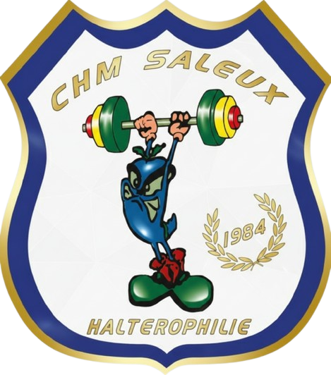

<p align="center">
  
</p>

<h1 align="center">CHM Saleux - Application de Gestion</h1>

<p align="center">
  Platforme numérique officielle du club d'haltérophilie et musculation de Saleux.
  <br>
  <em>Gestion des adhérents, suivi des performances et administration du club.</em>
</p>

<p align="center">
  <a href="https://github.com/enzodheilly/chm-saleux-app">
    
  </a>
  
  
  
  
  
</p>

---

## 📋 À propos

Ce projet est une application web complète développée pour moderniser la gestion interne du **CHM Saleux**. Elle permet aux administrateurs de gérer les membres et offre aux adhérents un espace personnel pour suivre leur progression.

L'architecture repose sur **Symfony** (MVC) avec une conteneurisation **Docker** pour faciliter le déploiement.

---

## 🛠️ Stack Technique

| Domaine             | Technologies                 |
| :------------------ | :--------------------------- |
| **Backend**         | Symfony 6/7, PHP 8.2         |
| **Frontend**        | Twig, SCSS, JavaScript (ES6) |
| **Base de données** | MySQL 8.0                    |
| **DevOps**          | Docker, Docker Compose       |
| **Outils**          | VS Code, Git, Composer, NPM  |

---

## ⚙️ Fonctionnalités

### 👤 Espace Adhérent

- **Dashboard :** Vue d'ensemble du profil et des dernières activités.
- **Licences :** Suivi du statut (active, renouvellement, documents).
- **Historique :** Visualisation des anciennes séances.

### 🏋️‍♂️ Performance & Entraînement

- **Tracking :** Enregistrement des séances (séries, répétitions, poids).
- **Programmes :** _(En cours)_ Assignation de programmes personnalisés par les coachs.
- **Statistiques :** Graphiques de progression.

### 📱 Mobile & API

- Architecture prête pour une future application mobile (API Platform).
- Connexion unifiée Web/Mobile.

---

## 🚀 Installation & Démarrage

Suivez ces étapes pour lancer le projet en local.

### Prérequis

- Docker & Docker Compose
- Node.js & NPM

### 1. Cloner le projet

```bash
git clone https://github.com/enzodheilly/chm-saleux-app.git
cd chm-saleux-app
```

### 2. Configuration

Dupliquez le fichier d'exemple pour configurer vos variables d'environnement :

```bash
cp .env.example .env
```

### 3. Lancer l'environnement

Démarrez les conteneurs Docker (Base de données, PHP, etc.) :

```bash
docker compose up -d
```

### 4. Installer les dépendances

Installez les librairies PHP et les assets Frontend :

```bash
# Backend (PHP)
composer install

# Frontend (Assets)
npm install
npm run build
```

### 5. Base de données

Créez la base de données et les tables :

```bash
php bin/console doctrine:database:create
php bin/console doctrine:migrations:migrate
```

L'application est accessible sur : http://localhost:8000

## 📂 Structure du projet

- **bin/** : Exécutables Symfony
- **config/** : Configuration globale
- **migrations/** : Versionning de la base de données
- **public/** : Assets et point d’entrée
- **src/** : Code source (Controllers, Entity)
- **templates/** : Vues Twig

<p align="center">
Made with ❤️ for CHM Saleux
</p>
